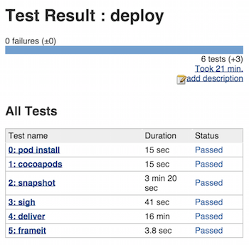

# Jenkins Integration
(or any other Continuous Integration system)

Deploying from your own computer isn't cool. You know what's cool? Letting a remote server publish app updates for you.

`fastlane` automatically generates a JUnit report for you. This allows Continuous Integration systems, like `Jenkins`, access the results of your deployment.

## Installation

The recommended way to install [Jenkins](http://jenkins-ci.org/) is through [homebrew](http://brew.sh/):

```brew update && brew install jenkins```

From now on start ```Jenkins``` by running:

```
jenkins
```

To store the password in the Keychain of your remote machine, I recommend running `sigh` or `deliver` using ssh or remote desktop at least once.

## Deploy Strategy

You should **not** deploy a new App Store update after every commit, since you still have to wait a few weeks for the review and might reset your number of stars. Instead I recommend using Git Tags, or custom triggers to deploy a new update.

You can set up your own ```Release``` job, which is only triggered manually.

## Plugins

I recommend the following plugins:

- **[HTML Publisher Plugin](https://wiki.jenkins-ci.org/display/JENKINS/HTML+Publisher+Plugin):** Can be used to show the generated screenshots right inside Jenkins.
- **[AnsiColor Plugin](https://wiki.jenkins-ci.org/display/JENKINS/AnsiColor+Plugin):** Used to show the coloured output of the fastlane tools. Don’t forget to enable `Color ANSI Console Output` in the `Build Environment` or your project.
- **[Rebuild Plugin](https://wiki.jenkins-ci.org/display/JENKINS/Rebuild+Plugin):** This plugin will save you a lot of time.
- **[Keychains and Provisioning Profiles Plugin](https://wiki.jenkins-ci.org/display/JENKINS/Keychains+and+Provisioning+Profiles+Plugin):** Manages keychains across Jenkins installations.

## Build Step

Use the following as your build step:

```
fastlane release
```

Replace `release` with the lane you want to use.

### setup_jenkins

You can use `setup_jenkins` action which integrates well with the [Keychains and Provisioning Profiles Plugin](https://wiki.jenkins-ci.org/display/JENKINS/Keychains+and+Provisioning+Profiles+Plugin). Selected keychain will automatically unlocked and the selected code signing identity will be used. Also all build results, like IPA files, archives, dSYMs and result bundles will be stored in the `./output` folder in the job workspace. In additions `setup_jenkins` will create separate derived data folder for each job (in the `./derivedData`).

Under the hood `setup_jenkins` configures other actions like: `gym`, `scan`, `xcodebuild`, `backup_xcarchive` and `clear_derived_data`.

## Test Results and Screenshots

To show the **deployment result** right in `Jenkins`

- *Add post-build action*
- *Publish JUnit test result report*
- *Test report XMLs*: `fastlane/report.xml`

To show the **generated screenhots** right in `Jenkins`

- *Add post-build action*
- *Publish HTML reports*
- *HTML directory to archive*: `fastlane/screenshots`
- *Index page*: `screenshots.html`

Save and run. The result should look like this:


