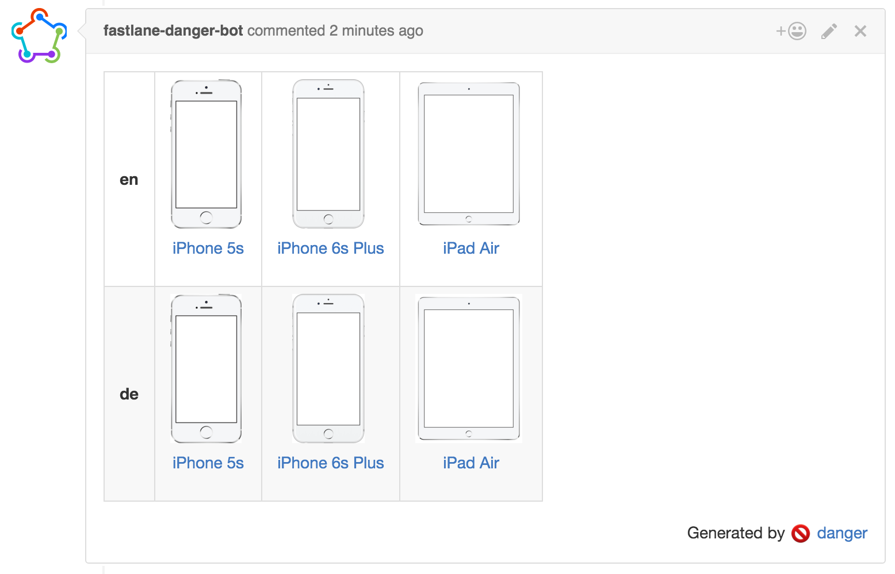

# fastlane danger Device Grid

Ever dream of testing your app straight from a pull request? Well now you can! With [fastlane](https://fastlane.tools), [danger](https://github.com/danger/danger) and [appetize.io](https://appetize.io/), you can stream your latest changes right from the browser.

No more manually installing and testing your app just to review a PR.



[View Example Pull Request](https://github.com/Themoji/ios/pull/12#issuecomment-215836315)

## Requirements

- [fastlane](https://fastlane.tools)
- [danger](https://github.com/danger/danger)
- [appetize.io](https://appetize.io/) account
- A Continuous Integration system

## Getting started

### Install fastlane and danger

Create a `Gemfile` in your project's directory with the following content

```ruby
gem "fastlane"
gem "danger"
gem "danger-device_grid"
```

and run

```
bundle install
```

### Setup `fastlane`

Skip this step if you're already using `fastlane` (which you should)

```
fastlane init
```

### Setup `danger`

```
bundle exec danger init
```

Follow the `danger` guide to authenticate with GitHub

### Configure `danger`

Edit `Dangerfile` and replace the content with

```ruby
puts "Running fastlane to generate and upload an ipa file..."

options = {
  xcodebuild: {
      workspace: "YourApp.xcworkspace",
      scheme: "YourScheme"
    }
}

require 'fastlane'
result = Fastlane::OneOff.run(action: "build_and_upload_to_appetize",
                          parameters: options)

device_grid.run(
  public_key: result,
  languages: ["en", "de"],
  devices: ["iphone5s", "iphone6splus", "ipadair"]
)
```

Make sure to fill in your actual workspace and scheme, or use the `project` parameter `project: "YourApp.xcworkspace"`.

### Try it

Push everything to GitHub in its own branch and create a PR to trigger your CI system. 

### Make use of deep linking

When you submit a PR you usually know what part of your app should be reviewed. Make it easier for everyone by providing a deep link, launching the app at the right point. To do so, use emojis (what else):

Add this to the bottom of your PR-body:

```
:link: com.krausefx.app://bacons/show/937
```

### Make use of `NSUserDefaults`

To do a runtime check if if the app is running on `Appetize`, just use:

```objective-c
[[NSUserDefaults standardUserDefaults] objectForKey:@"isAppetize"]
```

### Generate `appetize` stream, without the grid

Add the following to your `Fastfile` to build and upload your app to `appetize`. 

```ruby
desc "Build your app and upload it to Appetize to stream it in your browser"
lane :upload_to_appetize do
  build_and_upload_to_appetize(
    xcodebuild: {
      workspace: "YourApp.xcworkspace",
      scheme: "YourScheme"
    }
  )
end
```

Run the newly created lane using

```
fastlane upload_to_appetize
```

### Manual way using `appetize_viewing_url_generator`

If you want even more control over the way your app is built, you can also manually generate your `.app` and then upload it to `appetize`.

Use the `appetize` action together with `appetize_viewing_url_generator`. Make sure to build with the `iphonesimulator` SDK, since `appetize` runs iOS simulators to stream your application.

```ruby
tmp_path = "/tmp/fastlane_build"
xcodebuild(
  workspace: "Themoji.xcworkspace",
  sdk: "iphonesimulator",
  scheme: "Themoji",
  derivedDataPath: tmp_path
)

app_path = Dir[File.join(tmp_path, "**", "*.app")].last
UI.user_error!("Couldn't find app") unless app_path

zipped_bundle = zip(path: app_path, output_path: File.join(tmp_path, "Result.zip"))

appetize(
  path: zipped_bundle,
  api_token: 'yourapitoken' # get it from https://appetize.io/docs#request-api-token
)

url = appetize_viewing_url_generator(scale: "75", color: "black", public_key: "123123")
UI.message("Generated URL: #{url}")
```

#### Disclaimer

All product names, logos, and brands are property of their respective owners.  
The used device frames were provided by Facebook via the [Facebook Design Resources](https://facebook.github.io/design/devices.html). `fastlane` is in no way affiliated with Facebook.

> While Facebook has redrawn and shares these assets for the benefit of the design community, Facebook does not own any of the underlying product or user interface designs. By accessing these assets, you agree to obtain all necessary permissions from the underlying rights holders and/or adhere to any applicable brand use guidelines before using them. Facebook disclaims all express or implied warranties with respect to these assets, including non-infringement of intellectual property rights.
